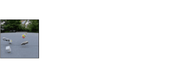

## Slot Attention for Video (SAVi)

This repository contains the code release for "Conditional Object-Centric
Learning from Video" (ICLR 2022).



Paper: https://arxiv.org/abs/2111.12594

Project website: https://slot-attention-video.github.io/


## Instructions
> ℹ️ The following instructions assume that you are using JAX on GPUs and have CUDA and CuDNN installed. For more details on how to use JAX with accelerators, including requirements and TPUs, please read the [JAX installation instructions](https://github.com/google/jax#installation).

Get dependencies and run model training via
```sh
./run.sh
```

Or use
```sh
pip3 install -r requirements.txt
```
to install dependencies and
```sh
python -m savi.main --config savi/configs/movi/savi_conditional_small.py --workdir tmp/
```
to train the smallest SAVi model (SAVi-S) on the [MOVi-A](https://github.com/google-research/kubric/blob/main/challenges/movi/README.md) dataset.

The MOVi datasets are stored in a [Google Cloud Storage (GCS) bucket](https://console.cloud.google.com/storage/browser/kubric-public/tfds)
and can be downloaded to local disk prior to training for improved efficiency.

To use a local copy of MOVi-A, for example, please copy the relevant folder to your local disk and set `data_dir` in the config file (`configs/movi/savi_conditional.py`) to point to it.  In more detail, first copy using commands such as

```
gsutil -m cp -r gs://kubric-public/tfds/movi_a/128x128/1.0.0 ./movi_a_128x128/
mkdir movi_a
mv movi_a_128x128/ movi_a/128x128/
```

The resulting directory structure will be as follows:
<pre>
.
|-- movi_a
|   `-- 128x128
|       `-- 1.0.0
|-- savi
|   |-- configs
|   |   `-- movi
|   |-- lib
|   |-- modules
</pre>

In order to use the local copy simply set `data_dir = "./"` in the config file `configs/movi/savi_conditional_small.py`. You can also copy it into a different location and set the `data_dir` accordingly.

To run SAVi on other MOVi dataset variants, follow the instructions above while replacing `movi_a` with, e.g. `movi_b` or `movi_c`.

## Expected results

At present, this repository only contains the SAVi model configurations without ResNet backbone from our [ICLR 2022 paper](https://arxiv.org/abs/2111.12594). We here refer to these models as SAVi-S and SAVi-M. SAVi-S is trained and evaluated on downscaled 64x64 frames, whereas SAVi-M uses 128x128 frames and a larger CNN backbone. Expected results and a configuration file for the largest SAVi model variant with ResNet backbone (SAVi-L) will be added shortly.

The released MOVi datasets as part of [Kubric](https://github.com/google-research/kubric/) differ slightly from the ones used in our [ICLR 2022 paper](https://arxiv.org/abs/2111.12594) and are of slightly higher complexity (e.g., more variation in backgrounds), results are therefore not directly comparable. MOVi-A is approximately comparable to the "MOVi" dataset used in our [ICLR 2022 paper](https://arxiv.org/abs/2111.12594), whereas MOVi-C is approximately comparable to "MOVi++". We provide updated results for our released configs and the MOVi datasets with version `1.0.0` below.

| Model      | MOVi-A     | MOVi-B     | MOVi-C     | MOVi-D     | MOVi-E     |
|------------|------------|------------|------------|------------|------------|
| **SAVi-S** | 92.1 ± 0.1 | 72.2 ± 0.5 | 64.7 ± 0.3 | 33.8 ± 7.7 | 8.3 ± 0.9  |
| **SAVi-M** | 92.5 ± 1.7 | 78.6 ± 0.3 | 69.4 ± 0.6 | 29.2 ± 8.5 | 14.0 ± 1.0 |
| **SAVi-L** | TBA        | TBA        | TBA        | TBA        | TBA        |

All results are in terms of **FG-ARI** (in %) on validation splits. Mean ± standard error over 5 seeds. All SAVi models reported above use bounding boxes of the first video frame as conditioning signal.

## Cite

```
@inproceedings{kipf2022conditional,
    author = {Kipf, Thomas and Elsayed, Gamaleldin F. and Mahendran, Aravindh
              and Stone, Austin and Sabour, Sara and Heigold, Georg
              and Jonschkowski, Rico and Dosovitskiy, Alexey and Greff, Klaus},
    title = {{Conditional Object-Centric Learning from Video}},
    booktitle = {International Conference on Learning Representations (ICLR)},
    year  = {2022}
}
```

## Disclaimer
This is not an official Google product.
